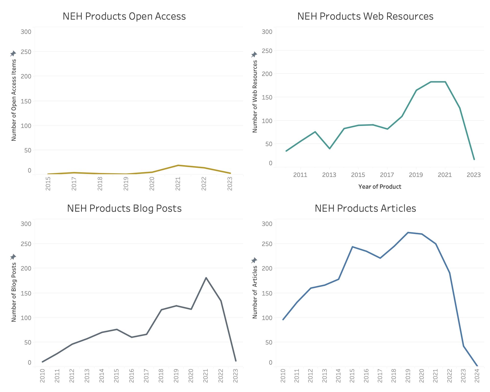
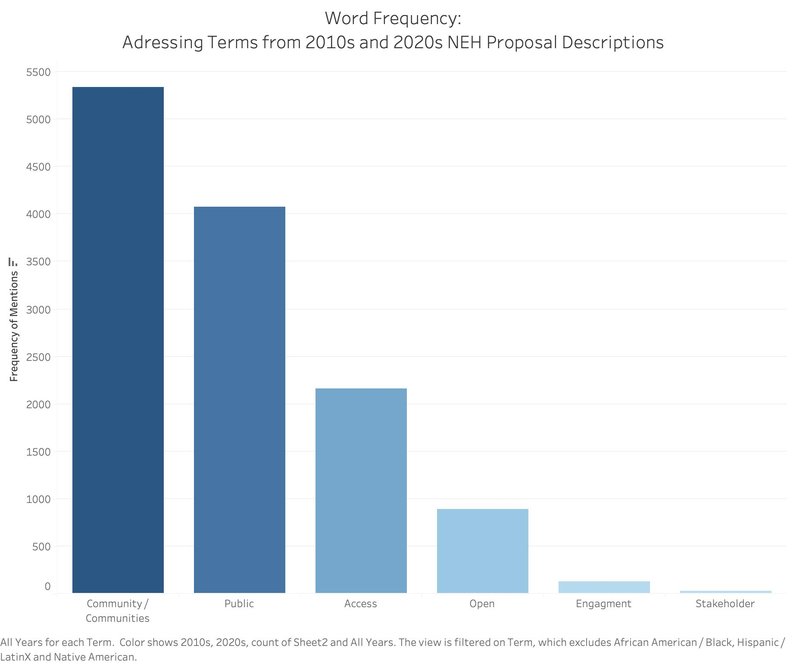

# E. Slayton Application for NEH Humanities Data Scientist 

### Introduction to Application

For Decades the National Endowment for the Humanities (NEH) has focused on supporting research that brings humanistic perspectives to high quaility research projects and progams, which in turn ensures the humanities available to all Americans. But what does it truly mean to make the humanities avilable to all Americans? Is it giving access to informaiton collected to empower communties to understand their presents and their pasts? Is it providing open resources that can inform on what it means to be human, fostering critical thinking, and promoting appreciation for the work it takes to connect with big ideas. 

While the White House has declared 2023 the 'Year of Open Science,' we can equally embrace it as a year dedicated to 'Open Research' and 'Open Humanities. This concerted effort to promote openness in research and the humanities reflects a broader global shift towards transparency, collaboration, and the democratization of knowledge. With an increasing interest in making informaiton open, accessible, and resuable, it is clear understanding how humanities projcts work and share data is crucial to supporting the growth of future knowledge and fostering collaborative work between researchers and engaged citizens.  

Understanding and appreciating the projects funded by the NEH is pivotal to nurturing a thriving ecosystem of ideas, and it is clear from evaluating NEH project descriptions that they have sponsered the development of a lot of big ideas [emma: to much big idea, what is another phrase?]. Studying the words that make up these descriptions shows an empahsis on preserving and collecting information, developing opperunities for education through exibits in meseums of content in classrooms. Clearly a base reading of the NEH project dataset is calling out for an evaluation of what information is made available for us and our neighbors to learn from.   

The above wordcloud shows the popularity of terms used to sketch out big ideas in humanities research. 

### Open Access and Open Data on the Humanities for Communities 

In the spirit of 'Open Humanities', it is perhaps helpful to define what we mean explictly. 'Open Humanities' can refer the movement within the field of humanities that advocates for openness, transparency, and accessibility in research, scholarship, and cultural content. As such, concepts like 'Open Access', making research outputs such as scholarly articles, books, and data freely accessible to the public, 'Open Data', the sharing of research data, archival materials, and primary sources, also can guide how we view and value NEH project controbutions to the public sphere. 

In order to conduct a breif evaluation NEH project data evalaute if any focused on engaging communities through the use of 'Open' resources, we can isolate specifics related to the terms 'Open', 'Access', and 'Public' as indicators of a focus on ensured access or public engagement with the project. There are hundreds of records of these terms being used in NEH project descriptions between 2010 and 2023. However, looking at the record of NEH products over time it is clear that there is still much that can be done to promote the development of digital content and project resources being made available after the completion of the grant. When we contrast the NEH product categories of Open Access Resources, Blog Posts, and Web Resources with the more conventional platform for Articles, it becomes apparent that between 2010 and 2023, there has been a shift in our online communication methods with the public. However, it is evident that Open Access Resources still lag behind in this transition. Given the commitment of numerous government agencies to promote, and in certain instances mandate, the creation of Open Access Materials and making data accessible, the NEH is presented with the chance to take the lead in shaping novel approaches that inspire humanities researchers, including those less familiar with digital outputs, to actively participate in this endeavor.

Motivating researchers to share their information with a wider audience may require nothing more than highlighting the advantages of open access materials and data sources, which can enhance community involvement and engagement with humanities projects. Aditional review of terms from NEH project descriptions does suggest community access is important to researchers as there is a clear focus on public needs include. This encompasses a multitude of instances where terms such as 'community,' 'communities,' 'stakeholder,' and 'engagement' are frequently used. Interestingly, when we compare the focus of project descriptions to other concepts, such as community engagment by looking for terms such as community, communities, stakeholders there is an prevelence of focus on commmunties - or people served by or engaged with a project - over stakeholders - those citzens who are active participants in the research process, it is clear that projects are more focused on the former than the later. This could influence how we perceive the effectiveness of NEH projects, as we actively aim to engage the public as commmunties in the content generated by these projects and tailor our research objectives accordingly. 

### The Ethics of Access and Privacy surounding with Open Data 

For humanists, grasping who the audience is for the information they handle is pivotal. As so many projects undertaken in the humanties focus on human subjects or cultural groups, being aware of why we are asking questions and how is essential in order to tailor research outputs accordingly. Being mindful of the audience may also necesitate being mindful of who we are collecting or curating data about. Progressively, humanities researchers are shedding light on the existing disparities in data collection—revealing the divides that exist between who data is collected about and who is absent, as well as how we work with and process that data that may disadvantage certain communties. It is also imperative to address privacy concerns comprehensively. Not all information can or should be made public. While we want to encourage as much openess without our data as possible there must always be thoughtful limits set in place to guide information access protocols. 

Ensuring openness also means making sure that access is equitable, not only in terms of who can access the data but also regarding the nature of the data itself. Striking a balance between access, ethics, and privacy is essential. Evident in the diverse range type of project outcomes - webiste, articles, datasets - produced by NEH projects is the humanists' commitment to facilitating multiple entry points to information and enabling diverse modes of engagement, accommodating varying levels of digital literacy and technological accessibility. The rise in publicly and virtually accessible results over time, which dismantles the academic barriers often hindering information access, also demonstrates the NEH's evolving dedication to involving community partners in scholarly endeavors.

As such, though the data provided here is all publically avilable, we must be careful to ensure that the information we are sharing as to the location of projects, their scope, and the individuals involved are respected in the process. It is likely that devling further into reports assocaited with these projects, as well as their planned strategies for data managment and informaiton sharing, may lead to more complex and interesting findings that could, if adverstized thoughtfully and shared ethically, support citizen engagement with research projects. 

### Connecting Projects to Congressional Interests 

Understanding the impact of humanties and making that research open also involves breaking down barriers to access, whether they are geographical, economic, or educational, so that individuals from all walks of life can engage with humanties focused projects and programs. Additionally, both citizens and USA repersenatives may be inerterested in evaluating how to better understand the geographic distribution of funded projects as well as to engage with existing NEH projects that are already focused on open data that have relevancy to their constituents. 

To connect these questions to the our focus on open access to products and data produced by NEH projects, the following interactive visualization explores both the location of projects awareded but also links through a hover feature informaiton on the description and award type. In addition to showcasing the description, the hover feature will also indicate whether the terms (or varaitions of) 'community', 'open', or 'access' apear in the description. This will also hopefully help to quickly define which projects are on track to meet open access and informaiton sharing goals, and which current projects are in need of support. 

<noscript></noscript><object class='tableauViz'  style='display:none;'><param name='host_url' value='https%3A%2F%2Fpublic.tableau.com%2F' /> <param name='embed_code_version' value='3' /> <param name='site_root' value='' /><param name='name' value='Slayton_NEH_2&#47;NEHProjects' /><param name='tabs' value='no' /><param name='toolbar' value='yes' /><param name='static_image' value='https:&#47;&#47;public.tableau.com&#47;static&#47;images&#47;Sl&#47;Slayton_NEH_2&#47;NEHProjects&#47;1.png' /> <param name='animate_transition' value='yes' /><param name='display_static_image' value='yes' /><param name='display_spinner' value='yes' /><param name='display_overlay' value='yes' /><param name='display_count' value='yes' /><param name='language' value='en-US' /><param name='filter' value='publish=yes' /></object>
 

[To Access the Working Dashboard Visit This Page: https://public.tableau.com/views/Slayton_NEH_2/NEHProjects?:language=en-US&publish=yes&:display_count=n&:origin=viz_share_link ] 

In order to delve into further into the question of how much funding is shared by county across various project types through different devisions of the NEH, an additional interactive map has been produced to allow for side by side comparison and click through options for those citizens or repersenatives interested in honing in on their district. 

<noscript></noscript><object class='tableauViz'  style='display:none;'><param name='host_url' value='https%3A%2F%2Fpublic.tableau.com%2F' /> <param name='embed_code_version' value='3' /> <param name='site_root' value='' /><param name='name' value='Slayton_NEH_1&#47;Dashboard2' /><param name='tabs' value='no' /><param name='toolbar' value='yes' /><param name='static_image' value='https:&#47;&#47;public.tableau.com&#47;static&#47;images&#47;Sl&#47;Slayton_NEH_1&#47;Dashboard2&#47;1.png' /> <param name='animate_transition' value='yes' /><param name='display_static_image' value='yes' /><param name='display_spinner' value='yes' /><param name='display_overlay' value='yes' /><param name='display_count' value='yes' /><param name='language' value='en-US' /><param name='filter' value='publish=yes' /></object>
         

     
[To Access the Working Dashboard Visit This Page: https://public.tableau.com/views/Slayton_NEH_1/Dashboard2?:language=en-US&publish=yes&:display_count=n&:origin=viz_share_link ] 

The above dashboard can be compared againt the below interactive dashboard, which shows the location of each project and through the interactive hover feature offers the name of the county the project is located in and the addition of wether the project description includes the core terms of 'community', 'open', or 'access'. By shifting between the two graphs to ascertain specifics of projects within each county it may become easier to idetify trends based on geographic location as well, enabeling the NEH to spot counties which are exceeding expectations in making their work accessible to the public. 

<noscript></noscript><object class='tableauViz'  style='display:none;'><param name='host_url' value='https%3A%2F%2Fpublic.tableau.com%2F' /> <param name='embed_code_version' value='3' /> <param name='site_root' value='' /><param name='name' value='Slayton_NEH_3&#47;NEHProjects_1' /><param name='tabs' value='no' /><param name='toolbar' value='yes' /><param name='static_image' value='https:&#47;&#47;public.tableau.com&#47;static&#47;images&#47;Sl&#47;Slayton_NEH_3&#47;NEHProjects_1&#47;1.png' /> <param name='animate_transition' value='yes' /><param name='display_static_image' value='yes' /><param name='display_spinner' value='yes' /><param name='display_overlay' value='yes' /><param name='display_count' value='yes' /><param name='language' value='en-US' /><param name='filter' value='publish=yes' /></object>

[To Access the Working Dashboard Visit This Page: https://public.tableau.com/views/Slayton_NEH_3/NEHProjects_1?:language=en-US&publish=yes&:display_count=n&:origin=viz_share_link ] 

### Exploration of the NEH Data 

Though this project begins to explore the relationship between Open Data, Open Access Resources, and community interests existing in NEH projects, it would be impossible to conduct a full evaluation in the short timeframe provided for this work. Given more time with this data, an broader assessment of this information could unlock the presence of themes related to Diversity, Equity, Inclusion, and Accessibility in ways that were difficult quickly scope due to either missing or messy data. 

Challanges in evaluating the open nature of these projects comes in the lack of available project description from the NEH_Grants1990s file. However, we may assume that due to the earlier record of these grant awards - being assigned not later than 2000 and finished no later than 2013, that not all grants were carried out during a period with the same level of supports for open access to materials and access to digital tools or digital literacies. To keep with the theme of comparing open scholarship to community engagment and access, and to ensure fidelity across the data, this effort focused on projects that were funded post 2010 when digital and computational resources were more often included as product outputs of NEH projects. 

There were also some chalanges when searching for key terms in the data related to the need for extensive data cleaning. In addition, some key term seperation from context in searches made it difficult to fully evaluate the full context of the proposals. For example, when regarding the graph above, it is also important to take into account that while African American and Black were terms searched, Black was only selected in cases where the key find clearly related to ethnicity. More scrutiny of the data is needed to fully evaluate the level of focus given to Balck American or African American populations within NEH projects.  

### Code and Processess Used In This Project 

** RStudio ** 
References to Code Resources:
- TM package (https://cran.r-project.org/web/packages/tm/vignettes/tm.pdf) 
- XML package (https://www.omegahat.net/RSXML/Tour.pdf)
  - XML Parser (https://www.rdocumentation.org/packages/XML/versions/3.99-0.14/topics/xmlTreeParse)
  - XML Getnodeset (https://www.rdocumentation.org/packages/XML/versions/1.2-0/topics/getNodeSet ) 
- Wordcloud with R (https://www.rdocumentation.org/packages/wordcloud/versions/2.6/topics/wordcloud) 
- Colorbrewer R package (https://rdrr.io/cran/RColorBrewer/man/ColorBrewer.html) 
- Finding associations in R (https://www.rdocumentation.org/packages/tm/versions/0.7-11/topics/findAssocs)
- Frequency of terms in R (https://www.rdocumentation.org/packages/tm/versions/0.7-11/topics/findFreqTerm)

  A more detailed description of processess followed in R can be found in the assocaited Rscript -> https://github.com/DrESlayton/NEH_Humanities_Data_Scientist/blob/main/NEH_2023.R  

** Tableau **

All the graphs (but the wordcloud) linked above were made using the tool Tableau. A short description of the process for making these graphs is shared blow:

(Graph 1) Small multiples line graph of the number of dimenson data NEH Product types (rows) Open Access, Articles, Blog Posts, and Web Resources from 2010 to 2023 expressed in years (columns).

(Graph 2) Bar Chart built from the meaure data count (rows) of dimension data taken from Term labels (collumn) 'community/communities', 'public', 'access', 'open', 'engagment', 'stakeholder'. 

(Graph 3)Interactive dashaboard showcasing the location of projects (measure data, geographic longitude and latitude data) filtered by dimension data year and also applicant type (dimension data). 

(Graph 4) A interactive dashboard with side by side maps showcasing the location of counties with projects funded, either in original funding awards or supplimental funding awards. These graphs also share a filter which enables drop down selection of NEH Devision Type as well as to scroll through funding year by year. 

(Graph 5)Interactive map that showcases the location of projects (dimension data) as well as details in hover feature the county in which the project is located as well as dimension data taken from Term labels 'community/communities', 'access', 'open'. 

(Graph 6) Heat Table showing counts of dimension data Term lebels (rows) by measure data year (collumns) for 'community/communities', 'public', 'access', 'open', 'engagment', 'stakeholder', 'Native American', 'African American / Black', 'Hispanic / Latinx'. 

In developing visulizations, sometimes even if a software ir propreitary it can be the right one to use due to the target audiences familairty with the tool. In the past several years, Tableau has pushed into the public sector, and many government offices use this tool to viuslize their data. Due to the publics familairty with the visual framework and style lense of Tableau, as well as its advanced capability for interactive graphs - I choose to use this tool over open source options like R ggplot2 or R Leaflet. 

** Open Refine **

Processes in Open Refine include managing columns through column splitting. This was achieved by using the column drop down > Edit Columns > Split into several columns. 

### Data Managment Plan 

The data for this project can be accessed through the github page assocaited with this project and maintained by Emma Slayton. 

Data will be maintained for a minimum of one year post the submision deadline (September 16th, 2023). 

