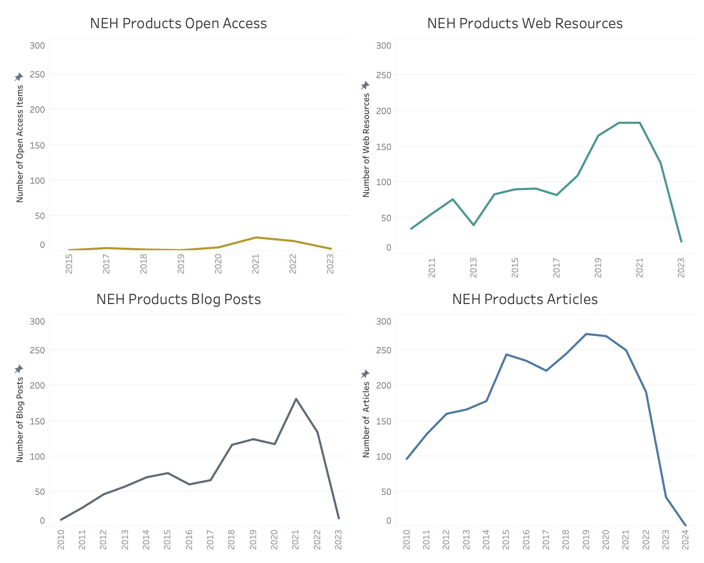

# E. Slayton Application for NEH Humanities Data Scientist 

### Introduction to Application

While the White House has declared 2023 the 'Year of Open Science,' we can equally embrace it as a year dedicated to 'Open Research' and 'Open Humanities’. This concerted effort to promote openness in research and the humanities reflects a broader global shift towards transparency, collaboration, and the democratization of knowledge. With an increasing interest in making information open, accessible, and reusable, understanding how humanities projects are developed and share data is crucial to supporting the growth of future knowledge and fostering collaborative work between researchers and engaged citizens.

Understanding and appreciating the projects funded by the NEH is pivotal to nurturing a thriving ecosystem of ideas, and it is clear from evaluating NEH project descriptions that they have done so. Studying the words that make up these descriptions shows an emphasis on preserving and collecting information, developing opportunities for education through exabits in museums and content in classrooms. Defining and comprehending open data allows us to address ethical and privacy concerns tied to data, which are directly relevant to congressional objectives aimed at ensuring public access to data funded by taxpayers.

Graph 1: The above word cloud shows the popularity of terms used to sketch out big ideas in humanities research.

### Open Access and Open Data on the Humanities for Communities 

'Open Humanities' can refer to the movement within the field of humanities that advocates for openness, transparency, and accessibility in research, scholarship, and cultural content. Concepts like 'Open Access'- making research outputs such as scholarly articles, books, and data freely accessible to the public- and 'Open Data'- the sharing of research data, archival materials, and primary sources, can guide how we view and value NEH project contributions to the public sphere.

By evaluating NEH project data, through isolating specifics related to the terms 'Open', 'Access', and 'Public' as indicators of a focus on ensured access or public engagement, we can see how the use of “open” resources engages communities. Open resources engage communities, which is evidenced by the hundreds of examples of these terms being used in NEH project descriptions between 2010 and 2023. However, looking at the record of NEH products over time indicates that there is still much that can be done to promote the development of digital content and project resources even after the completion of the grant. When we contrast the NEH product categories of Open Access Resources, Blog Posts, and Web Resources with the more conventional platform for Articles, it becomes apparent that between 2010 and 2023, there has been a shift in online communication methods with the public. However, it is evident that Open Access Resources still lag in this transition. 

Graph 2: This displays change in product output from NEH funded projects over the period of 2010 to 2023. The products referenced are Articles, Blog Posts, Open Access, and Web Resources. Be aware that the steep decline towards the end of the lines may be tied to recently awarded projects not yet having products to share. 

Given the commitment of numerous government agencies to promote, and in certain instances mandate, the creation of Open Access Materials and making data accessible, the NEH is presented with the opportunity to take the lead in shaping novel approaches that inspire humanities researchers, including those less familiar with digital outputs, to actively participate in this endeavor. Motivating researchers to share their information with a wider audience may require nothing more than highlighting the advantages of open access materials and data sources, which can enhance community involvement and engagement with humanities projects. Additional review of terms from NEH project descriptions, as shown in the Graph 3, does suggest community access is important to researchers, as there is a clear focus on the inclusion of public needs. This encompasses a multitude of instances where terms such as 'community,' 'communities,' 'stakeholder,' and 'engagement' are frequently used. Interestingly, when we compare the focus of project descriptions on these concepts, projects are more focused on communities - or people served by or engaged with a project - over stakeholders - those citizens who are active participants in the research process. When project awardees actively engage with the public as communities rather than merely as stakeholders, it could signal innovative methods for assessing the impact of open access to NEH-funded data on the overall effectiveness of NEH projects.

Graph 3: The Frequency of set terms referenced NEH project descriptions. These terms include ‘community’, ‘public’, ‘access’, ‘open’, ‘engagement’, and ‘stakeholder’.

### The Ethics of Access and Privacy surounding with Open Data 

While we want to encourage as much openness within our data as possible there must always be thoughtful limits set in place to guide information access protocols. For humanists, understanding the audience for the information they develop is pivotal. As so many projects undertaken in the humanities focus on human subjects or cultural groups, being aware of why and how we are asking questions is essential in order to tailor research outputs accordingly. Being mindful of the audience may also necessitate being mindful of who we are collecting or curating data about. Recently, humanities researchers are shedding light on the existing disparities in data collection—revealing the divides that exist between who data is collected about and who is absent, as well as how we work with and process data that may disadvantage certain communities. It is also imperative to address privacy concerns comprehensively. Not all information can or should be made public. 

Ensuring openness also means making sure that access is equitable, not only in terms of who can access the data but also regarding the nature of the data itself. Striking a balance between access, ethics, and privacy is essential. Evident in the diverse range type of project outcomes - website, articles, datasets - produced by NEH projects is the humanists' commitment to facilitating multiple entry points to information and enabling diverse modes of engagement, accommodating varying levels of digital literacy and technological accessibility. The rise in publicly and virtually accessible results over time, which dismantles the academic barriers often hindering information access, also demonstrates the NEH's evolving dedication to involving community partners in scholarly endeavors.

Though the data provided here is all publicly available, we must be careful to ensure that the information we are sharing as to the location of projects, their scope, and the individuals involved are respected in the process. It is likely that delving further into reports associated with these projects, including their planned strategies for data management and information sharing, may lead to more complex and interesting findings that could, if advertised thoughtfully and shared ethically, support citizen engagement with research projects. Supporting public representatives access to this information could also enhance transparency, facilitate well-informed decision-making, and promote collaborative partnerships, thereby magnifying the positive influence of these research initiatives on society at large.

### Connecting Projects to Congressional Interests 

Understanding the impact of humanities and making that research open also involves breaking down barriers to access, whether they are geographical, economic, or educational, so that individuals from all walks of life can engage with humanities-focused projects and programs. Additionally, both citizens and elected representatives may be interested in better understanding the geographic distribution of funded projects as well as engaging e with existing NEH projects that are already focused on open data that have relevancy to their constituents.

To connect these questions to the focus on open access to products and data produced by NEH projects, the following interactive visualization explores both the location of projects awarded but also links through a hover feature information on the description and award type. In addition to showcasing the description, the hover feature will also indicate whether the terms (or variations of) 'community', 'open', or 'access' appear in the description. This will also help to quickly define which projects are on track to meet open access and information sharing goals, and which current projects need support.

    
Graph 4: This map showcases the exact geographic locations of NEH funded projects, separated by those granted to ‘Individuals’ and to ‘Institutions’. 
[To Access the Working Dashboard Visit This Page: [https://public.tableau.com/views/Slayton_NEH_2/NEHProjects?:language=en-US&publish=yes&:display_count=n&:origin=viz_share_link] (To start your exploration of the graph, use the year awarded slide on the top left to select 2010. Then hover your cursor over the orange dot at the southern tip of Florida State. This dot represents the institutional funded ‘Laughing at “Lo Politico” project, whose description includes the term access.)

In order to delve into further into the question of how much funding is shared by county across various project types through different divisions of the NEH, an additional interactive map allows for side-by-side comparison and click through options for those citizens or representatives interested in homing in on their district.

       
Graph 5: These two maps show the comparison between average funding amounts originally and supplementally awarded through the NEH to different congressional districts.
[To Access the Working Dashboard Visit This Page: [https://public.tableau.com/views/Slayton_NEH_1/Dashboard2?:language=en-US&publish=yes&:display_count=n&:origin=viz_share_link](To start your exploration of the graph, use the year awarded slide on the top left to select 2010. This will display an interesting look at how counties that receive less on average for original awards get more as supplemental awards than other counties.)

The above dashboard shown in Graph 5 can be compared against the interactive dashboard seen in Graph 6, which shows the location of each project and through the interactive hover feature offers the name of the county the project is located in and the addition of whether the project description includes the core terms of 'community', 'open', or 'access'. By shifting between the two graphs to ascertain specifics of projects within each county it may become easier to identify trends based on geographic location as well, enabling the NEH to spot counties which are exceeding expectations in making their work accessible to the public.

    
Graph 6: This map shows the location of each NEH projects funded between 2010 and 2023. 
[To Access the Working Dashboard Visit This Page: [https://public.tableau.com/views/Slayton_NEH_3/NEHProjects_1?:language=en-US&publish=yes&:display_count=n&:origin=viz_share_link](To start your exploration of this graph, hover over the green dot at the top right corner of the map. This shows a project in Maine’s 2nd Congressional District. You can then compare the location of this project to the funding elements shown in Graph 4).

### Exploration of the NEH Data 

Graph 7: This table showcases the frequency of a set list of terms based on their presence in NEH project descriptions funded between 2010 and 2023.

Though this project begins to explore the relationship between Open Data, Open Access Resources, and community interests existing in NEH projects, it would be impossible to conduct a full evaluation in the short timeframe provided for this work. Given more time with this data, a broader assessment of this information could unlock the presence of themes related to Diversity, Equity, Inclusion, and Accessibility in ways that were difficult to quickly scope, due to either missing or messy data.

Challenges in evaluating the open nature of these projects occur because of the lack of available project description from the NEH_Grants1990s file. However, we may assume that due to the earlier record of these grant awards - being assigned not later than 2000 and finished no later than 2013, that not all grants were carried out during a period with the same levels of support for open access to materials and access to digital tools or digital literacies. In order to compare open scholarship to community engagement and access, and to ensure fidelity across the data, this effort focused on projects that were funded post-2010 when digital and computational resources were more often included as product outputs of NEH projects.

There were also some challenges when searching for key terms in the data related to the need for extensive data cleaning. In addition, some key term separation from context in searches made it difficult to fully evaluate the full context of the proposals. For example, when regarding Graph 6, it is also important to take into account that while African American and Black were terms searched, Black was only selected in cases where the key find clearly related to ethnicity. More scrutiny of the data is needed to fully evaluate the level of focus given to marginalized or previously undermeasured populations within NEH projects.

### Code and Processess Used In This Project 

** RStudio ** References to Code Resources:
- TM package (https://cran.r-project.org/web/packages/tm/vignettes/tm.pdf)
- XML package (https://www.omegahat.net/RSXML/Tour.pdf)
     - XML Parser (https://www.rdocumentation.org/packages/XML/versions/3.99-0.14/topics/xmlTreeParse)
     - XML Getnodeset (https://www.rdocumentation.org/packages/XML/versions/1.2-0/topics/getNodeSet )
- Wordcloud with R (https://www.rdocumentation.org/packages/wordcloud/versions/2.6/topics/wordcloud)
- Colorbrewer R package (https://rdrr.io/cran/RColorBrewer/man/ColorBrewer.html)
- Finding associations in R (https://www.rdocumentation.org/packages/tm/versions/0.7-11/topics/findAssocs)
- Frequency of terms in R (https://www.rdocumentation.org/packages/tm/versions/0.7-11/topics/findFreqTerm)

A more detailed description of processes followed in R can be found in the associated Rscript -> https://github.com/DrESlayton/NEH_Humanities_Data_Scientist/blob/main/Rscript_Tableau_Files/NEH_2023.R 

** Tableau **

In developing visualizations, sometimes even if a software is proprietary it can be the right one to use due to the target audience’s familiarity with the tool. Recently, Tableau has pushed into the public sector, and many government offices use this tool to visualize their data. Due to the public’s familiarity with the visual framework and style lens of Tableau, as well as its advanced capability for interactive graphs - I choose to use this tool over open-source options like R ggplot2 or R Leaflet.

All the graphs (except the word cloud) linked above were made using the tool Tableau. A short description of the process for making these graphs is shared below:

(Graph 2) Small multiples line graph of the number of dimension data NEH Product types (rows) Open Access, Articles, Blog Posts, and Web Resources from 2010 to 2023 expressed in years (columns).

(Graph 3) Bar Chart built from the measure data count (rows) of dimension data taken from Term labels (column) 'community/communities', 'public', 'access', 'open', 'engagement', 'stakeholder'.

(Graph 4) Interactive dashboard showcasing the location of projects (measure data, geographic longitude and latitude data) filtered by dimension data year and also applicant type (dimension data).

(Graph 5) A interactive dashboard with side-by-side maps showcasing the location of counties with projects funded, either in original funding awards or supplemental funding awards. These graphs also share a filter which enables drop down selection of NEH Division Type as well as to scroll through funding year by year.

(Graph 6) Interactive map that showcases the location of projects (dimension data) as well as details in hover feature the county in which the project is located as well as dimension data taken from Term labels 'community/communities', 'access', 'open'.

(Graph 7) Heat Table showing counts of dimension data Term labels (rows) by measure data year (columns) for 'community/communities', 'public', 'access', 'open', 'engagement', 'stakeholder', 'Native American', 'African American / Black', 'Hispanic / Latinx'.

** Open Refine **

Processes in Open Refine include managing columns through column splitting. This was achieved by using the column drop down > Edit Columns > Split into several columns.

### Data Managment Plan 

The data for this project can be accessed through the GitHub page associated with this project and maintained by Emma Slayton.

Data will be maintained for a minimum of one year after the submission deadline (September 16, 2023).

